## Data Analysis - Report
Last update: ``Tue Jul 29 18:01:15 2014``

### Preanalysis of Data
* Setting the global options and loading the libraries and functions required for the analysis

```r
library(knitr)
opts_chunk$set(echo = FALSE, message = FALSE, warning = FALSE, fig.height = 7, fig.width = 9)
library(survival)
```

```
## Loading required package: splines
```

```r
source(file = "StandardAnalysis2.R")
source(file = "SurvivalPlot.R")
options(scipen = 999)
```

* Opening the dataset, selecting variables relevant to the analysis, and dropping unused levels

```r
arid1a.full <- read.csv(file = "arid1a.utuc.csv")
arid1a.data<- arid1a.full[c("sex", "age", "location", "location2", "pT", "pT.2", "pT.a", "WHO.grade", "lymph.nodes", "lvi", "metastasis", "bladder.recur", "fu.recur", "tumor.prog", "fu.prog", "outcome", "dod", "fu.outcome", "tumor.h.med", "tumor.pos.med", "normal.h.med", "normal.pos.med", "tumor.h.0", "tumor.h.p50", "tumor.h.q3", "tumor.pos.0", "tumor.pos.p50", "tumor.pos.q3")]
arid1a.data <- droplevels(arid1a.data)
attach(arid1a.data)
```
***

### ARID1a in Normal and Tumor Tissues
In this section we compare ARID1a levels (H-scores and percentages) between normal (Var #1) and tumor (Var #2) tissues using the Mann-Whitney U test and boxplots.

* Comparing ARID1a H-scores

```
##        Median   IQR
## Var #1  196.2 221.2
## Var #2  165.0 207.5
## 
## Mann-Whitney's P value = 0.7682
```

 

* Comparing ARID1a percentages

```
##        Median IQR
## Var #1  90.00  50
## Var #2  86.25  45
## 
## Mann-Whitney's P value = 0.07216
```

 

***

### Description of Clinicopathologic Features and Outcome
In this section we describe the clinicopathologic features and outcome of our patients.

#### Clinical features
* Patient's age

```
##        Values
## Mean     70.0
## SD        8.9
## Median   71.0
## IQR      11.5
## Min      48.0
## Max      87.0
```
* Patient's sex

```
##        Count Percentages
## Female    39        39.4
## Male      60        60.6
```

#### Pathologic features
* Tumor location

```
##               Count Percentages
## Pelvis           45        45.5
## Pelvis-Ureter     4         4.0
## Ureter           50        50.5
```
* pT stage

```
##     Count Percentages
## pT1    18        18.2
## pT2     8         8.1
## pT3    48        48.5
## pT4     6         6.1
## pTa    19        19.2
```
* WHO histologic grade

```
##            Count Percentages
## High Grade    84        84.8
## Low Grade     15        15.2
```
* Lymphovascular invasion

```
##     Count Percentages
## No     59        59.6
## Yes    40        40.4
```
* Lymph node metastasis

```
##      Count Percentages
## No      84        84.8
## Yes     12        12.1
## <NA>     3         3.0
```

#### Outcome features
* Distant metastasis

```
##      Count Percentages
## No      90        90.9
## Yes      4         4.0
## <NA>     5         5.1
```
* Bladder recurrence

```
##      Count Percentages
## No      65        65.7
## Yes     32        32.3
## <NA>     2         2.0
```
* Tumor progression

```
##     Count Percentages
## No     61        61.6
## Yes    38        38.4
```
* Patient's outcome

```
##     Count Percentages
## AWD     5         5.1
## DOC     3         3.0
## DOD    30        30.3
## LFU    23        23.2
## NED    38        38.4
```
***

### Association of Clinicopathologic Features and ARID1a Expression with Tumor Progression
In this section we compare clinicopathologic features and ARID1a expression between patients with and without tumor progression, using the Mann-Whitney U test and the Fisher's exact test. From 99 patients, 38 patients showed tumor progression during follow-up. Adjusted P values using Hommel's correction are provided at the end of this section.

#### Clinical features
* Patient's age

```
##     Median IQR
## No      71  15
## Yes     72  12
## 
## Mann-Whitney's P value = 0.1467
```
* Patient's sex

```
## **Table of Frequencies**
##         Column
## Row      No Yes
##   Female 26  13
##   Male   35  25
## 
## **Row Percentages**
##         Column
## Row      No Yes
##   Female 67  33
##   Male   58  42
## 
## **Column Percentages**
##         Column
## Row      No Yes
##   Female 43  34
##   Male   57  66
## 
## Fisher's P value = 0.5262
```

#### Pathologic features
* Tumor location

```
## **Table of Frequencies**
##                Column
## Row             No Yes
##   Pelvis        30  15
##   Pelvis-Ureter  2   2
##   Ureter        29  21
## 
## **Row Percentages**
##                Column
## Row             No Yes
##   Pelvis        67  33
##   Pelvis-Ureter 50  50
##   Ureter        58  42
## 
## **Column Percentages**
##                Column
## Row             No Yes
##   Pelvis        49  39
##   Pelvis-Ureter  3   5
##   Ureter        48  55
## 
## Fisher's P value = 0.5787
```
* pT stage

```
## **Table of Frequencies**
##      Column
## Row   No Yes
##   pT1 17   1
##   pT2  6   2
##   pT3 19  29
##   pT4  1   5
##   pTa 18   1
## 
## **Row Percentages**
##      Column
## Row   No Yes
##   pT1 94   6
##   pT2 75  25
##   pT3 40  60
##   pT4 17  83
##   pTa 95   5
## 
## **Column Percentages**
##      Column
## Row   No Yes
##   pT1 28   3
##   pT2 10   5
##   pT3 31  76
##   pT4  2  13
##   pTa 30   3
## 
## Fisher's P value = 0.0000001278
```
* WHO histologic grade

```
## **Table of Frequencies**
##             Column
## Row          No Yes
##   High Grade 48  36
##   Low Grade  13   2
## 
## **Row Percentages**
##             Column
## Row          No Yes
##   High Grade 57  43
##   Low Grade  87  13
## 
## **Column Percentages**
##             Column
## Row          No Yes
##   High Grade 79  95
##   Low Grade  21   5
## 
## Fisher's P value = 0.04221
```
* Lymph node metastasis

```
## **Table of Frequencies**
##      Column
## Row   No Yes
##   No  55  29
##   Yes  3   9
## 
## **Row Percentages**
##      Column
## Row   No Yes
##   No  65  35
##   Yes 25  75
## 
## **Column Percentages**
##      Column
## Row   No Yes
##   No  95  76
##   Yes  5  24
## 
## Fisher's P value = 0.01085
```
* Lymmphovascular invasion

```
## **Table of Frequencies**
##      Column
## Row   No Yes
##   No  48  11
##   Yes 13  27
## 
## **Row Percentages**
##      Column
## Row   No Yes
##   No  81  19
##   Yes 32  68
## 
## **Column Percentages**
##      Column
## Row   No Yes
##   No  79  29
##   Yes 21  71
## 
## Fisher's P value = 0.000001918
```

#### ARID1a expression
* Tumor median H-score

```
##     Median   IQR
## No     160 207.5
## Yes    170 214.4
## 
## Mann-Whitney's P value = 0.6049
```
* Tumor median % positive cells

```
##     Median  IQR
## No      90 41.9
## Yes     75 48.8
## 
## Mann-Whitney's P value = 0.9046
```

#### Adjusted P values
In this section we provide the adjusted P values for the preceding tests using Hommel's correction.

```
##                               Raw P values Adjusted P values
## Patient's age                 0.1467000000        0.73350000
## Patient's sex                 0.5262000000        0.90460000
## Tumor location                0.5787000000        0.90460000
## pT stage                      0.0000001278        0.00000115
## WHO histologic grade          0.0422100000        0.25326000
## Lymph node metastasis         0.0108500000        0.07595000
## lymphovascular invasion       0.0000019180        0.00001534
## Tumor median H-score          0.6049000000        0.90460000
## Tumor median % positive cells 0.9046000000        0.90460000
```
***

### Association of Clinicopathologic Features and ARID1a Expression with Cancer-Related Mortality
In this section we compare clinicopathologic features and ARID1a expression between patients who died of cancer and who didn't, using the Mann-Whitney U test and the Fisher's exact test. From 99 patients, 30 patients died of cancer during follow-up. Adjusted P values using Hommel's correction are provided at the end of this section.

#### Clinical features
* Patient's age

```
##     Median  IQR
## No    71.0 14.0
## Yes   71.5 10.5
## 
## Mann-Whitney's P value = 0.4832
```
* Patient's sex

```
## **Table of Frequencies**
##         Column
## Row      No Yes
##   Female 29  10
##   Male   40  20
## 
## **Row Percentages**
##         Column
## Row      No Yes
##   Female 74  26
##   Male   67  33
## 
## **Column Percentages**
##         Column
## Row      No Yes
##   Female 42  33
##   Male   58  67
## 
## Fisher's P value = 0.5044
```

#### Pathologic features
* Tumor location

```
## **Table of Frequencies**
##                Column
## Row             No Yes
##   Pelvis        32  13
##   Pelvis-Ureter  3   1
##   Ureter        34  16
## 
## **Row Percentages**
##                Column
## Row             No Yes
##   Pelvis        71  29
##   Pelvis-Ureter 75  25
##   Ureter        68  32
## 
## **Column Percentages**
##                Column
## Row             No Yes
##   Pelvis        46  43
##   Pelvis-Ureter  4   3
##   Ureter        49  53
## 
## Fisher's P value = 0.9269
```
* pT stage

```
## **Table of Frequencies**
##      Column
## Row   No Yes
##   pT1 18   0
##   pT2  6   2
##   pT3 25  23
##   pT4  1   5
##   pTa 19   0
## 
## **Row Percentages**
##      Column
## Row    No Yes
##   pT1 100   0
##   pT2  75  25
##   pT3  52  48
##   pT4  17  83
##   pTa 100   0
## 
## **Column Percentages**
##      Column
## Row   No Yes
##   pT1 26   0
##   pT2  9   7
##   pT3 36  77
##   pT4  1  17
##   pTa 28   0
## 
## Fisher's P value = 0.0000001284
```
* WHO histologic grade

```
## **Table of Frequencies**
##             Column
## Row          No Yes
##   High Grade 55  29
##   Low Grade  14   1
## 
## **Row Percentages**
##             Column
## Row          No Yes
##   High Grade 65  35
##   Low Grade  93   7
## 
## **Column Percentages**
##             Column
## Row          No Yes
##   High Grade 80  97
##   Low Grade  20   3
## 
## Fisher's P value = 0.03395
```
* Lymph node metastasis

```
## **Table of Frequencies**
##      Column
## Row   No Yes
##   No  61  23
##   Yes  5   7
## 
## **Row Percentages**
##      Column
## Row   No Yes
##   No  73  27
##   Yes 42  58
## 
## **Column Percentages**
##      Column
## Row   No Yes
##   No  92  77
##   Yes  8  23
## 
## Fisher's P value = 0.04492
```
* Lymphovascular invasion

```
## **Table of Frequencies**
##      Column
## Row   No Yes
##   No  51   8
##   Yes 18  22
## 
## **Row Percentages**
##      Column
## Row   No Yes
##   No  86  14
##   Yes 45  55
## 
## **Column Percentages**
##      Column
## Row   No Yes
##   No  74  27
##   Yes 26  73
## 
## Fisher's P value = 0.00001606
```

#### ARID1a expression
* Tumor median H-score

```
##     Median IQR
## No   177.5 205
## Yes  130.0 215
## 
## Mann-Whitney's P value = 0.8966
```
* Tumor median % positive cells

```
##     Median IQR
## No      90  35
## Yes     75  55
## 
## Mann-Whitney's P value = 0.3724
```

#### Adjusted P values
In this section we provide the adjusted P values for the preceding tests using Hommel's correction.

```
##                               Raw P values Adjusted P values
## Patient's age                 0.4832000000       0.926900000
## Patient's sex                 0.5044000000       0.926900000
## Tumor location                0.9269000000       0.926900000
## pT stage                      0.0000001284       0.000001156
## WHO histologic grade          0.0339500000       0.203700000
## Lymph node metastasis         0.0449200000       0.269520000
## lymphovascular invasion       0.0000160600       0.000128480
## Tumor median H-score          0.8966000000       0.926900000
## Tumor median % positive cells 0.3724000000       0.926900000
```
***

### Survival Plots for Tumor Progression and Cancer-Related Mortality
In this section we plot survival curves for tumor progression and cancer-related mortality. We used 3 cutoff points each of H-scores and % positive cells for ARID1a low/high expression. For H-scores: 1) H-score = 0 vs. H-score > 0; 2) H-score < median vs. H-score > median; 3) H-score < upper tertile (Q3) vs. H-score < Q3. For % positive cells: 1) % = 0 vs. % > 0; 2) % < median vs. % > median; 3) % < Q3 vs. % < Q3. Survival curves were drawn using the Kaplan-Meier method and compared using the log-rank test.


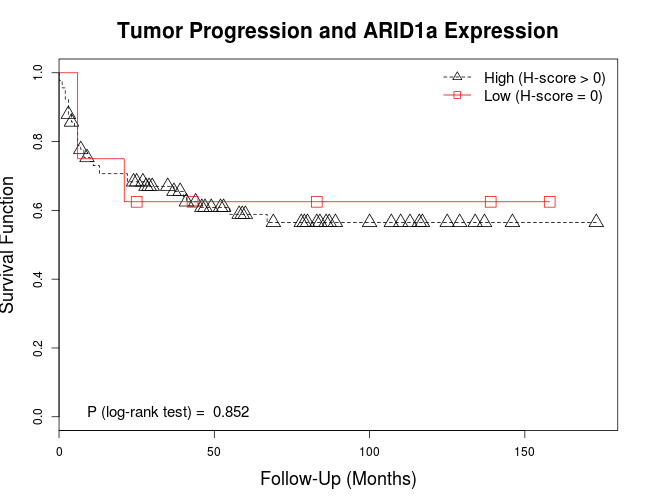 

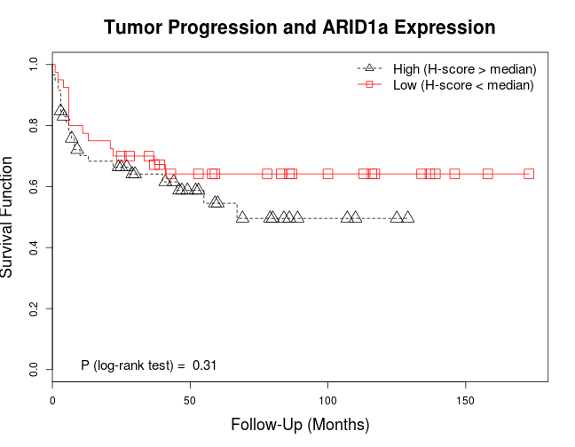 

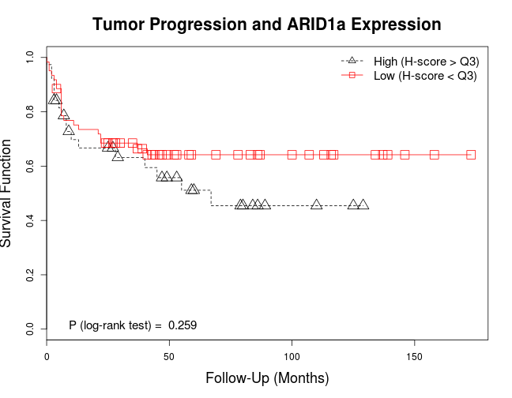 

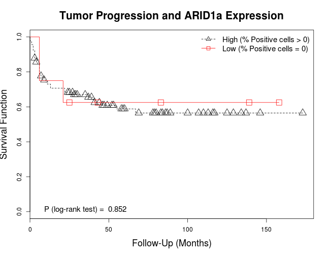 

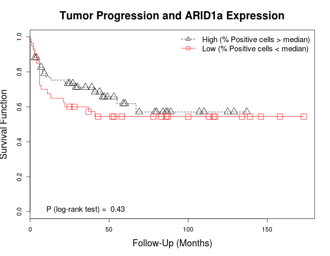 

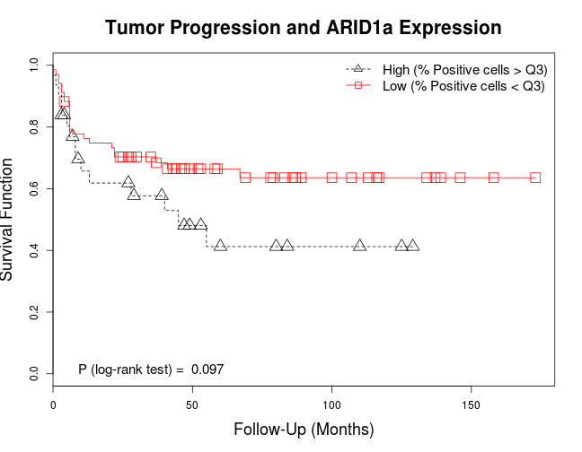 

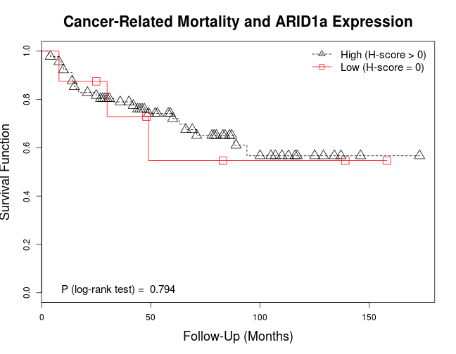 

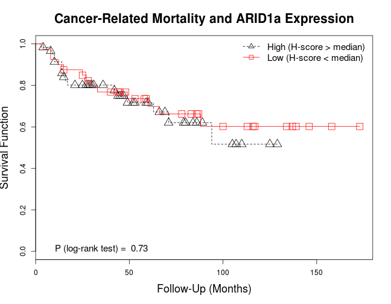 

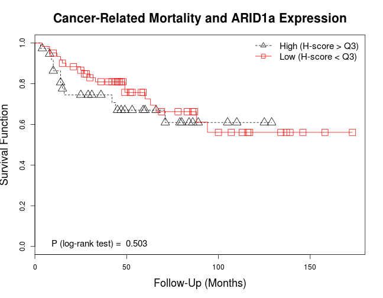 

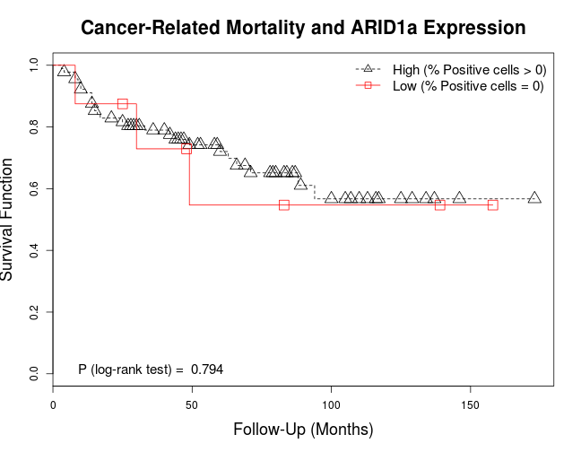 

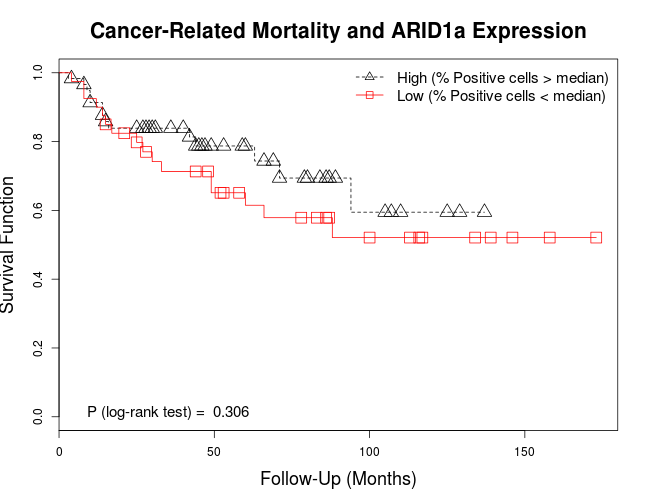 

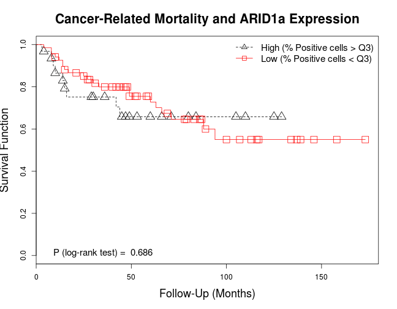 

### Odds Ratios for Tumor Progression
#### Clinical features
* Patient's age

```
## Odds Ratio      2.5 %     97.5 %    P value 
##     1.0447     0.9968     1.0987     0.0760
```
* Patient's sex

```
## Odds Ratio      2.5 %     97.5 %    P value 
##     1.4286     0.6216     3.3694     0.4056
```

#### Pathologic features
* Tumor location (Pelvis vs. ureter, tumors in pelvis-ureter excluded)

```
## Odds Ratio      2.5 %     97.5 %    P value 
##     1.4483     0.6302     3.3824     0.3854
```
* High pT stage (>pT2)

```
##  Odds Ratio       2.5 %      97.5 %     P value 
## 17.42500000  5.96829717 64.56889342  0.00000155
```
* WHO histologic grade

```
## Odds Ratio      2.5 %     97.5 %    P value 
##    0.20513    0.03083    0.80363    0.04519
```
* Metastatic lymph nodes

```
## Odds Ratio      2.5 %     97.5 %    P value 
##    5.68966    1.56197   27.15522    0.01366
```
* Lymphovascular invasion

```
##   Odds Ratio        2.5 %       97.5 %      P value 
##  9.062937063  3.682501219 23.936998667  0.000003491
```

#### ARID1a Expression, Unadjusted
* H-score = 0 vs. H-score > 0

```
## Odds Ratio      2.5 %     97.5 %    P value 
##     0.9600     0.1876     4.1610     0.9572
```
* H-score < median vs. H-score > median

```
## Odds Ratio      2.5 %     97.5 %    P value 
##     0.7853     0.3371     1.7938     0.5690
```
* H-score < upper quartile vs. H-score > upper quartile 

```
## Odds Ratio      2.5 %     97.5 %    P value 
##     0.6485     0.2815     1.4895     0.3061
```
* % positive cells = 0 vs. % positive cells > 0

```
## Odds Ratio      2.5 %     97.5 %    P value 
##     0.9600     0.1876     4.1610     0.9572
```
* % positive cells < median vs. % positive cells > median

```
## Odds Ratio      2.5 %     97.5 %    P value 
##     1.5955     0.6997     3.6594     0.2664
```
* % positive cells < upper quartile vs. % positive cells > upper quartile

```
## Odds Ratio      2.5 %     97.5 %    P value 
##     0.5452     0.2278     1.2976     0.1694
```

#### ARID1a, Adjusted by Clinicopathologic Features
Clinicopathologic features included age, sex, tumor location, WHO grade, lymph node metastastis and lymphovascular invasion.

* H-score = 0 vs. H-score > 0

```
## Odds Ratio      2.5 %     97.5 %    P value 
##     1.4391     0.1942     9.9143     0.7112
```
* H-score < median vs. H-score > median

```
## Odds Ratio      2.5 %     97.5 %    P value 
##     1.1348     0.3736     3.5379     0.8236
```
* H-score < upper quartile vs. H-score > upper quartile 

```
## Odds Ratio      2.5 %     97.5 %    P value 
##     1.0118     0.3569     2.9788     0.9825
```
* % positive cells = 0 vs. % positive cells > 0

```
## Odds Ratio      2.5 %     97.5 %    P value 
##     1.4391     0.1942     9.9143     0.7112
```
* % positive cells < median vs. % positive cells > median

```
## Odds Ratio      2.5 %     97.5 %    P value 
##     1.7810     0.6213     5.2797     0.2852
```
* % positive cells < upper quartile vs. % positive cells > upper quartile

```
## Odds Ratio      2.5 %     97.5 %    P value 
##     0.6513     0.2159     1.9539     0.4407
```
***

### Odds Ratios for Cancer-Specific Mortality
#### Clinical features
* Patient's age

```
## Odds Ratio      2.5 %     97.5 %    P value 
##     1.0259     0.9771     1.0802     0.3138
```
* Patient's sex

```
## Odds Ratio      2.5 %     97.5 %    P value 
##     1.4500     0.6002     3.6591     0.4169
```

#### Pathologic features
* Tumor location (Pelvis vs. ureter, tumors in pelvis-ureter excluded)

```
## Odds Ratio      2.5 %     97.5 %    P value 
##     1.1584     0.4825     2.8158     0.7424
```
* High pT stage (>pT2)

```
##   Odds Ratio        2.5 %       97.5 %      P value 
##  23.15384533   6.25496146 150.95284567   0.00004789
```
* WHO histologic grade

```
## Odds Ratio      2.5 %     97.5 %    P value 
##   0.135468   0.007295   0.726300   0.059368
```
* Metastatic lymph nodes

```
## Odds Ratio      2.5 %     97.5 %    P value 
##    3.71304    1.08025   13.68519    0.03872
```
* Lymphovascular invasion

```
##  Odds Ratio       2.5 %      97.5 %     P value 
##  7.79166667  3.05544395 21.65833675  0.00003434
```

#### ARID1a Expression, Unadjusted
* H-score = 0 vs. H-score > 0

```
## Odds Ratio      2.5 %     97.5 %    P value 
##     1.4222     0.2762     6.2186     0.6454
```
* H-score < median vs. H-score > median

```
## Odds Ratio      2.5 %     97.5 %    P value 
##     1.1895     0.4935     2.8354     0.6955
```
* H-score < upper quartile vs. H-score > upper quartile 

```
## Odds Ratio      2.5 %     97.5 %    P value 
##     0.9070     0.3785     2.2155     0.8274
```
* % positive cells = 0 vs. % positive cells > 0

```
## Odds Ratio      2.5 %     97.5 %    P value 
##     1.4222     0.2762     6.2186     0.6454
```
* % positive cells < median vs. % positive cells > median

```
## Odds Ratio      2.5 %     97.5 %    P value 
##    2.14286    0.89894    5.18936    0.08661
```
* % positive cells < upper quartile vs. % positive cells > upper quartile

```
## Odds Ratio      2.5 %     97.5 %    P value 
##     1.0922     0.4379     2.8628     0.8527
```

#### ARID1a, Adjusted by Clinicopathologic Features
Clinicopathologic features included age, sex, tumor location, WHO grade, lymph node metastastis and lymphovascular invasion.

* H-score = 0 vs. H-score > 0

```
## Odds Ratio      2.5 %     97.5 %    P value 
##     2.0186     0.2942    13.1335     0.4567
```
* H-score < median vs. H-score > median

```
## Odds Ratio      2.5 %     97.5 %    P value 
##     2.1426     0.7042     6.9912     0.1878
```
* H-score < upper quartile vs. H-score > upper quartile 

```
## Odds Ratio      2.5 %     97.5 %    P value 
##     1.6016     0.5584     4.9122     0.3915
```
* % positive cells = 0 vs. % positive cells > 0

```
## Odds Ratio      2.5 %     97.5 %    P value 
##     2.0186     0.2942    13.1335     0.4567
```
* % positive cells < median vs. % positive cells > median

```
## Odds Ratio      2.5 %     97.5 %    P value 
##    2.85288    0.98475    8.80805    0.05791
```
* % positive cells < upper quartile vs. % positive cells > upper quartile

```
## Odds Ratio      2.5 %     97.5 %    P value 
##     1.9122     0.6282     6.3381     0.2672
```
***

### Hazard Ratios for Tumor Progression
#### Clinical features
* Patient's age

```
## Hazard Ratio Lower 95% CI Upper 95% CI      P value 
##      1.03517      0.99718      1.07461      0.06999
```
* Patient's sex

```
## Hazard Ratio Lower 95% CI Upper 95% CI      P value 
##       1.3432       0.6867       2.6273       0.3888
```

#### Pathologic features
* Tumor location (Pelvis vs. ureter, tumors in pelvis-ureter excluded)

```
## Hazard Ratio Lower 95% CI Upper 95% CI      P value 
##       1.2537       0.6454       2.4353       0.5044
```
* High pT stage (>pT2)

```
## Hazard Ratio Lower 95% CI Upper 95% CI      P value 
## 11.385818883  4.018759488 32.257932336  0.000004698
```
* WHO histologic grade

```
## Hazard Ratio Lower 95% CI Upper 95% CI      P value 
##      0.22238      0.05339      0.92625      0.03890
```
* Metastatic lymph nodes

```
## Hazard Ratio Lower 95% CI Upper 95% CI      P value 
##   4.51742127   2.12256191   9.61436969   0.00009118
```
* Lymphovascular invasion

```
##  Hazard Ratio  Lower 95% CI  Upper 95% CI       P value 
##  5.9963921622  2.9584631960 12.1538503543  0.0000006727
```

#### ARID1a Unadjusted
* H-score = 0 vs. H-score > 0

```
## Hazard Ratio Lower 95% CI Upper 95% CI      P value 
##       0.9056       0.2784       2.9454       0.8691
```
* H-score < median vs. H-score > median

```
## Hazard Ratio Lower 95% CI Upper 95% CI      P value 
##       0.7166       0.3699       1.3884       0.3234
```
* H-score < upper quartile vs. H-score > upper quartile

```
## Hazard Ratio Lower 95% CI Upper 95% CI      P value 
##       0.6981       0.3681       1.3239       0.2710
```
* % positive cells = 0 vs. % positive cells > 0

```
## Hazard Ratio Lower 95% CI Upper 95% CI      P value 
##       0.9056       0.2784       2.9454       0.8691
```
* % positive cells < median vs. % positive cells > median

```
## Hazard Ratio Lower 95% CI Upper 95% CI      P value 
##       1.2987       0.6863       2.4575       0.4218
```
* % positive cells < upper quartile vs. % positive cells > upper quartile

```
## Hazard Ratio Lower 95% CI Upper 95% CI      P value 
##       0.5839       0.3042       1.1210       0.1060
```

#### ARID1a, Adjusted by Clinicopathologic Features
Clinicopathologic features included age, sex, tumor location, WHO grade, lymph node metastastis and lymphovascular invasion.

* H-score = 0 vs. H-score > 0

```
## Hazard Ratio Lower 95% CI Upper 95% CI      P value 
##       1.2015       0.3249       4.4437       0.7833
```
* H-score < median vs. H-score > median

```
## Hazard Ratio Lower 95% CI Upper 95% CI      P value 
##       0.8757       0.4298       1.7841       0.7147
```
* H-score < upper quartile vs. H-score > upper quartile

```
## Hazard Ratio Lower 95% CI Upper 95% CI      P value 
##       1.1050       0.5606       2.1781       0.7730
```
* % positive cells = 0 vs. % positive cells > 0

```
## Hazard Ratio Lower 95% CI Upper 95% CI      P value 
##       1.2015       0.3249       4.4437       0.7833
```
* % positive cells < median vs. % positive cells > median

```
## Hazard Ratio Lower 95% CI Upper 95% CI      P value 
##       1.3643       0.6948       2.6789       0.3669
```
* % positive cells < upper quartile vs. % positive cells > upper quartile

```
## Hazard Ratio Lower 95% CI Upper 95% CI      P value 
##       0.6918       0.3404       1.4057       0.3084
```
***

### Hazard Ratios for Cancer-Specific Mortality
#### Clinical features
* Patient's age

```
## Hazard Ratio Lower 95% CI Upper 95% CI      P value 
##       1.0348       0.9920       1.0795       0.1125
```
* Patient's sex

```
## Hazard Ratio Lower 95% CI Upper 95% CI      P value 
##       1.3324       0.6220       2.8540       0.4603
```

#### Pathologic features
* Tumor location (Pelvis vs. ureter, tumors in pelvis-ureter excluded)

```
## Hazard Ratio Lower 95% CI Upper 95% CI      P value 
##       1.2138       0.5824       2.5299       0.6050
```
* High pT stage (>pT2)

```
## Hazard Ratio Lower 95% CI Upper 95% CI      P value 
##  17.63446577   4.18533337  74.30098280   0.00009198
```
* WHO histologic grade

```
## Hazard Ratio Lower 95% CI Upper 95% CI      P value 
##      0.12834      0.01743      0.94491      0.04384
```
* Metastatic lymph nodes

```
## Hazard Ratio Lower 95% CI Upper 95% CI      P value 
##      2.75978      1.18046      6.45204      0.01914
```
* Lymphovascular invasion

```
## Hazard Ratio Lower 95% CI Upper 95% CI      P value 
##   5.63717096   2.50317695  12.69494607   0.00002977
```

#### ARID1a Unadjusted
* H-score = 0 vs. H-score > 0

```
## Hazard Ratio Lower 95% CI Upper 95% CI      P value 
##       1.1772       0.3568       3.8836       0.7888
```
* H-score < median vs. H-score > median

```
## Hazard Ratio Lower 95% CI Upper 95% CI      P value 
##       0.8791       0.4244       1.8209       0.7287
```
* H-score < upper quartile vs. H-score > upper quartile

```
## Hazard Ratio Lower 95% CI Upper 95% CI      P value 
##       0.7786       0.3745       1.6185       0.5026
```
* % positive cells = 0 vs. % positive cells > 0

```
## Hazard Ratio Lower 95% CI Upper 95% CI      P value 
##       1.1772       0.3568       3.8836       0.7888
```
* % positive cells < median vs. % positive cells > median

```
## Hazard Ratio Lower 95% CI Upper 95% CI      P value 
##       1.4539       0.7076       2.9874       0.3084
```
* % positive cells < upper quartile vs. % positive cells > upper quartile

```
## Hazard Ratio Lower 95% CI Upper 95% CI      P value 
##       0.8510       0.3892       1.8606       0.6860
```

#### ARID1a, Adjusted by Clinicopathologic Features
Clinicopathologic features included age, sex, tumor location, WHO grade, lymph node metastastis and lymphovascular invasion.

* H-score = 0 vs. H-score > 0

```
## Hazard Ratio Lower 95% CI Upper 95% CI      P value 
##       1.9287       0.5438       6.8399       0.3092
```
* H-score < median vs. H-score > median

```
## Hazard Ratio Lower 95% CI Upper 95% CI      P value 
##        1.299        0.582        2.899        0.523
```
* H-score < upper quartile vs. H-score > upper quartile

```
## Hazard Ratio Lower 95% CI Upper 95% CI      P value 
##       1.0998       0.4975       2.4312       0.8142
```
* % positive cells = 0 vs. % positive cells > 0

```
## Hazard Ratio Lower 95% CI Upper 95% CI      P value 
##       1.9287       0.5438       6.8399       0.3092
```
* % positive cells < median vs. % positive cells > median

```
## Hazard Ratio Lower 95% CI Upper 95% CI      P value 
##       1.6672       0.7577       3.6685       0.2039
```
* % positive cells < upper quartile vs. % positive cells > upper quartile

```
## Hazard Ratio Lower 95% CI Upper 95% CI      P value 
##       1.1021       0.4656       2.6089       0.8249
```
***
